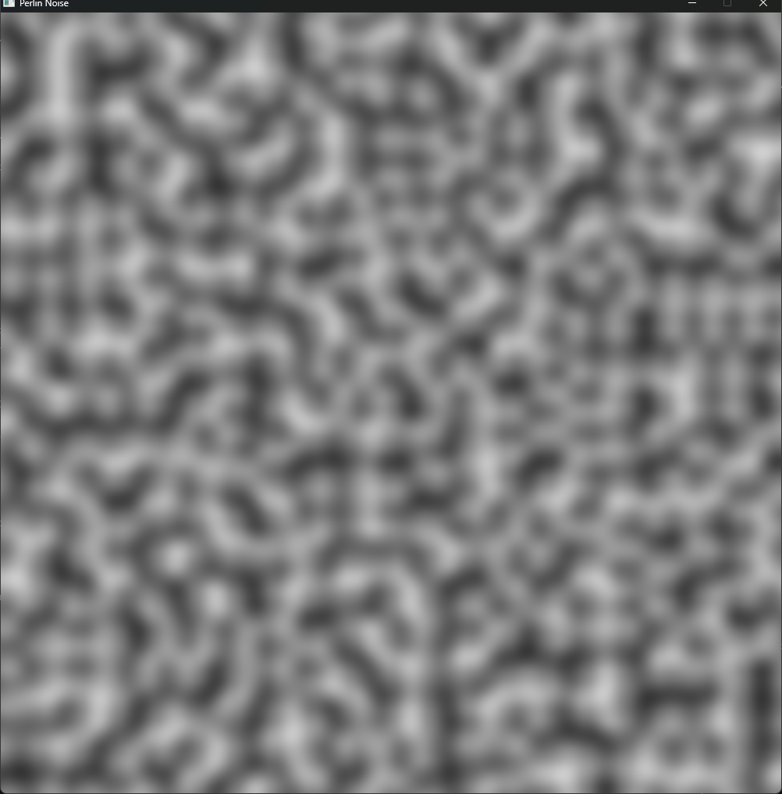

This project uses the PerlinNoise algorithm developed by **Ken Perlin** to generate a 2d noise texture that is smooth unline random noise

here is some more information about the algorithm [**Wikipedia**](https://en.wikipedia.org/wiki/Perlin_noise)

**Build Instructions:**

```git clone --recursive https://github.com/AlexSid0/PerlinNoise.git```

* If this was not done previously use ```git submodule update --init```

use the CMakeLists.txt to configure and compile the program

